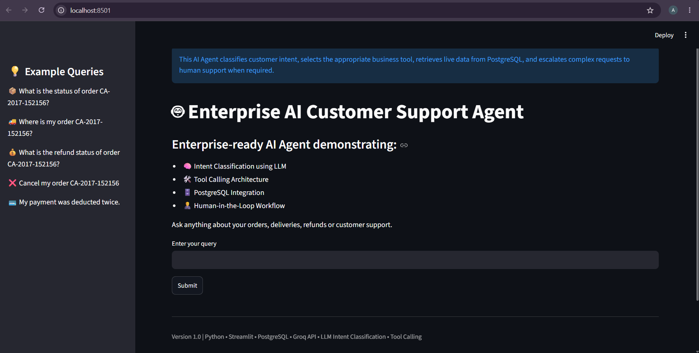
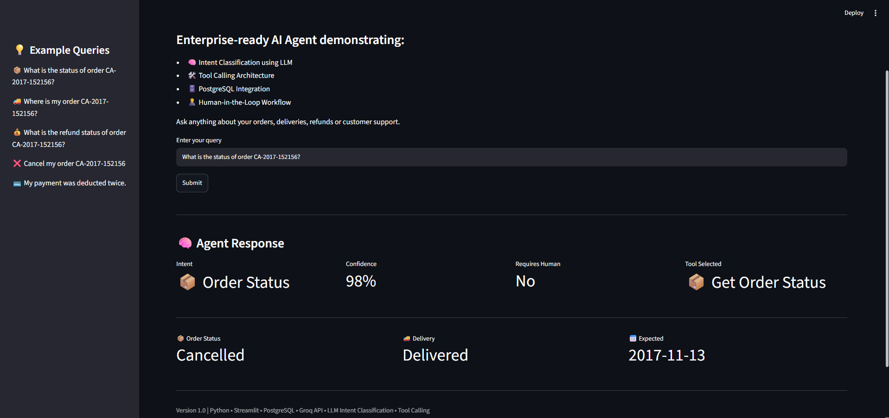
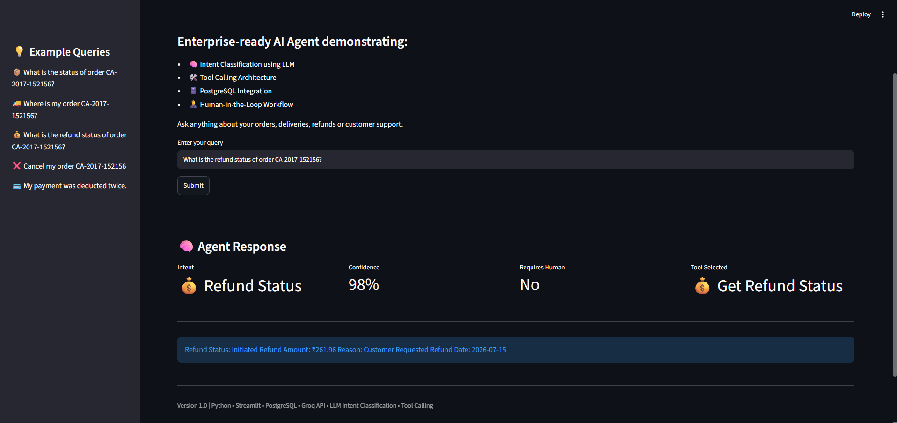
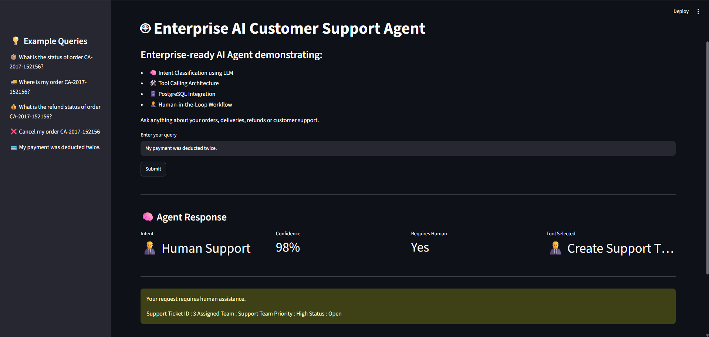

# 🤖 Enterprise AI Customer Support Agent

An enterprise-style AI Customer Support Agent built using **Python, PostgreSQL, Streamlit, and Large Language Models (LLMs)**.

This project demonstrates how an AI agent can understand natural language customer requests, classify customer intent using an LLM, intelligently route requests to business tools, retrieve live information from a PostgreSQL database, and escalate complex customer issues to human support when required.

---

## 🚀 Key Features

- 🧠 LLM-powered Intent Classification
- 🛠️ Tool Calling Architecture
- 🗄️ PostgreSQL Database Integration
- 📦 Order Status Tracking
- 🚚 Delivery Status Tracking
- 💰 Refund Status Tracking
- ❌ Order Cancellation
- 👨‍💼 Human-in-the-Loop Escalation
- 🎯 Confidence-based Decision Making
- 🌐 Interactive Streamlit Web Interface

---

# 📸 Application Preview

## Home Page



---

## Order Status



---

## Refund Status



---

## Human Support Escalation



---

# 🏗️ System Architecture

```
                    +----------------------+
                    |      Streamlit UI    |
                    +----------+-----------+
                               |
                               ▼
                    +----------------------+
                    |      AI Agent        |
                    | Intent Classification|
                    +----------+-----------+
                               |
                     +---------+---------+
                     |                   |
                     ▼                   ▼
              Business Tools     Human-in-the-Loop
                     |                   |
                     +---------+---------+
                               |
                               ▼
                    +----------------------+
                    | Repository Layer     |
                    +----------+-----------+
                               |
                               ▼
                    +----------------------+
                    | PostgreSQL Database  |
                    +----------------------+
```

---

# ⚙️ Request Workflow

1. User submits a customer support query.
2. The LLM classifies the customer's intent.
3. The AI agent extracts the order ID (when available).
4. The confidence score and human intervention requirement are evaluated.
5. The agent selects the appropriate business tool.
6. The selected tool interacts with PostgreSQL through the Repository Layer.
7. The response is returned to the user via the Streamlit interface.

---

# 📂 Project Structure

```
ai-customer-support-agent/

│
├── app.py
├── agent.py
├── llm_client.py
├── prompts.py
├── tools.py
├── import_data.py
│
├── database/
│   └── repository.py
│
├── data/
│   └── superstore_cleaned.csv
│
├── screenshots/
│   ├── home.png
│   ├── order_status.png
│   ├── refund_status.png
│   └── support_ticket.png
│
├── README.md
├── requirements.txt
├── .gitignore
└── .env.example
```

---

# 🛠️ Technology Stack

| Category | Technologies |
|----------|--------------|
| Programming Language | Python |
| AI | Groq API, OpenAI Compatible SDK |
| Prompt Engineering | Intent Classification |
| Database | PostgreSQL |
| ORM | SQLAlchemy |
| Database Driver | psycopg2 |
| Frontend | Streamlit |

---

# 💬 Example Queries

### 📦 Order Status

```
What is the status of order CA-2017-152156?
```

---

### 🚚 Delivery Status

```
Where is my order CA-2017-152156?
```

---

### 💰 Refund Status

```
What is the refund status of order CA-2017-152156?
```

---

### ❌ Cancel Order

```
Cancel my order CA-2017-152156
```

---

### 👨‍💼 Human Support

```
My payment was deducted twice.
```

---

# 💡 Design Decisions

This project follows a modular architecture inspired by enterprise AI systems.

### AI Agent

- Responsible only for reasoning and intent classification.
- Does **not** directly access or modify the database.

### Tool Calling

- The AI agent selects the appropriate business tool based on the classified intent.
- Business operations are executed through controlled tool calls.

### Repository Pattern

- All database operations are isolated inside the Repository Layer.
- Keeps business logic independent from database implementation.

### Human-in-the-Loop

- Sensitive or ambiguous customer issues are escalated instead of being handled automatically.

This separation of responsibilities makes the application easier to maintain, extend, and scale.

---

# 🚀 Getting Started

## 1. Clone the repository

```bash
git clone https://github.com/yourusername/ai-customer-support-agent.git

cd ai-customer-support-agent
```

---

## 2. Install dependencies

```bash
pip install -r requirements.txt
```

---

## 3. Configure Environment Variables

Create a `.env` file using `.env.example`.

```env
GROQ_API_KEY=your_api_key

DB_USERNAME=postgres
DB_PASSWORD=your_password
DB_HOST=localhost
DB_PORT=5432
DB_NAME=enterprise_ai_agent
```

---

## 4. Import the Dataset

```bash
python import_data.py
```

---

## 5. Launch the Application

```bash
streamlit run app.py
```

---

# 🔮 Future Improvements

- Conversation Memory
- Retrieval-Augmented Generation (RAG)
- Vector Database (FAISS / pgvector)
- Multi-Agent Architecture
- LangGraph Integration
- Docker Support
- Authentication
- Cloud Deployment
- Logging & Monitoring
- Automated Unit Testing

---

# 👨‍💻 Author

**Akhil Marada**

This project was developed as a portfolio project to demonstrate enterprise AI agent architecture using **LLM-powered intent classification, tool calling, PostgreSQL integration, and human-in-the-loop workflows.**

---

## ⭐ If you found this project interesting, consider giving it a star!